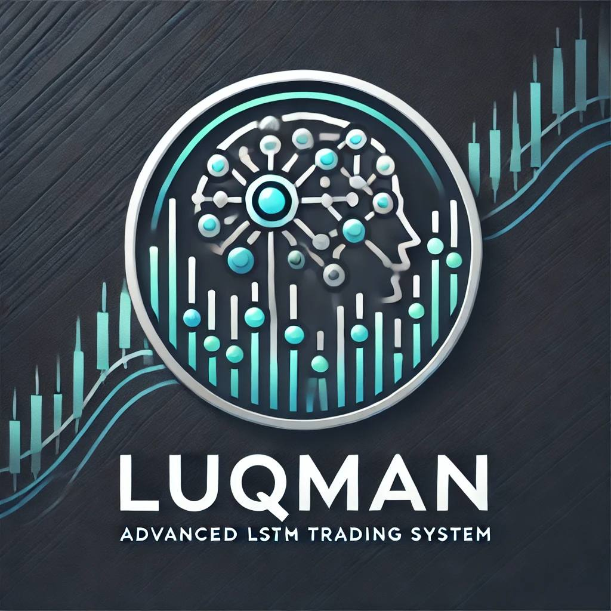

# Luqman



## Overview

Luqman is an intelligent trading assistant designed to empower users with advanced market analysis and data-driven decision-making capabilities. Named after the wise figure Luqman, the tool embodies the values of insight and guidance, aiming to demystify the complexities of trading and financial analysis. At its core, Luqman is not just an AI assistant but a comprehensive trading solution that leverages the latest developments in machine learning, sentiment analysis, and data science. Its vision is to democratize trading insights, providing sophisticated financial data analysis tools to traders and professionals who wish to make informed, strategic trading decisions.

## The Vision

The overarching vision of Luqman is to bridge the gap between financial data and actionable insights, transforming the trading landscape by providing clarity and transparency. Luqman aims to offer a powerful yet user-friendly interface that brings cutting-edge analytical techniques to traders of all backgrounds. By focusing on accessibility, it strives to lower the barriers that often restrict complex financial tools to institutional traders, thereby creating a more equitable financial environment.

Luqman serves as a guiding beacon for traders navigating volatile markets, enabling them to capitalize on opportunities with timely data and predictive analysis. Inspired by Islamic principles of wisdom and prudent decision-making, Luqman embodies a commitment to ethical and informed trading practices. Upcoming development sprints will focus on enhancing Luqman with advanced risk management strategies, trade automation, and customizable features to tailor Luqman to different financial markets.

## The Technical Overview

Luqman is built using state-of-the-art technologies to deliver a robust and scalable platform for trading analysis. It integrates multiple components, each serving a distinct analytical function:

- **Fundamental Analysis**: This module collects and processes financial statements and key indicators to assess a company’s intrinsic value. It integrates with external APIs to gather real-time data, providing deep insights into a company’s performance.
- **Technical Indicators**: Using various statistical models, this component analyzes historical market data to identify trends and potential price movements. Popular indicators such as moving averages, RSI, and Bollinger Bands are implemented to assist traders in evaluating entry and exit points.
- **Sentiment Analysis**: Leveraging machine learning models and external news sentiment APIs, Luqman provides insights into market psychology. By evaluating news, social media, and market reports, the sentiment analysis component helps in understanding the overall mood of the market towards specific assets.
- **Seasonality Component (Planned Feature)**: This future feature will offer insights into recurring patterns and trends based on historical data, such as monthly or quarterly effects that impact certain stocks or industries.
- **Macro-Economic Analysis**: This module tracks key macroeconomic indicators to understand broader market conditions that could impact trading decisions.

- **Technical Sentiment Indicators**: This component analyzes market trends and patterns using advanced statistical methods and machine learning models, aiming to predict market sentiment by identifying bullish or bearish signals through technical chart patterns.

The technical architecture of Luqman is designed to be modular and easily extendable, ensuring that new features and analytical tools can be integrated seamlessly over time. The solution is structured as a combination of Python-based machine learning scripts, data scrapers, and APIs, making it platform-agnostic and easily integrable into any environment—whether web, desktop, or mobile.

Luqman currently has six core features developed under the features component:

1. **Fundamental Score**: Evaluates the financial health of a company using a variety of fundamental metrics.
2. **Technical Sentiment Indicators**: Analyzes market trends and patterns using technical indicators to provide actionable insights.
3. **Sentiment Analysis**: Provides an aggregated sentiment score by analyzing relevant news and social media regarding specific companies.
4. **Macro-Economic Analysis**: Tracks and interprets economic indicators that impact market sentiment and decision-making.
5. **Seasonality Analysis (Planned Feature)**: Detects patterns and trends based on recurring seasonal data, allowing users to take advantage of market behaviors that happen cyclically.
6. **Technical Indicators**: Provides a comprehensive analysis of market data to help identify the optimal timing for trades.

## Quick Start Guide

This is a basic guide to running the Luqman system.

### Step 1: Set Up Virtual Environment

Activate the virtual environment for dependency isolation:

```
.\venv\Scripts\activate
```

### Step 2: Install Dependencies (First-Time Setup Only)

Install the necessary dependencies listed in `requirements.txt`:

```
pip install -r requirements.txt
```

### Step 3: Run a Feature Module

Run the sentiment analysis feature as an example:

```
python app/luqman/components/sentiment_analysis.py
```

## Contributions

Contributions to Luqman are welcome! Please feel free to raise issues or submit pull requests on GitHub to help improve this tool and make trading insights accessible to more users.
